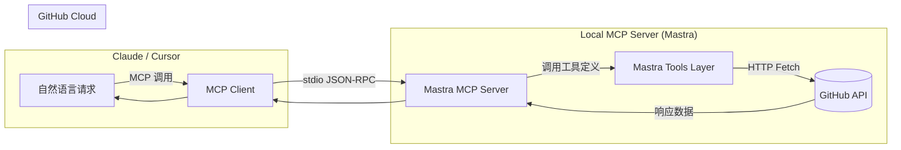

# GitHub Issue Assistant MCP (Mastra Version)

## 📌 项目简介

**GitHub Issue Assistant MCP** 是一个基于 [Mastra](https://mastra.io) 与 [Model Context Protocol (MCP)](https://modelcontextprotocol.io) 构建的智能开发工具，它允许你直接在 AI 对话（如 Claude Desktop、Cursor 等 MCP 客户端）中，通过自然语言创建、管理和查看 GitHub 仓库的 Issue。

本项目示范了如何：

* 使用 **Mastra** 快速搭建具备上下文处理能力的 MCP Server
* 通过 **GitHub REST API** 实现标准化 Issue 管理
* 将 AI 对话上下文无缝映射到实际研发任务

---

## 🎯 项目意图

本项目旨在展示**云端 AI 开发助手**与**研发自动化工具链**的融合。通过 Mastra，我们能够：

* 轻松注册和管理 MCP 工具
* 在执行前后注入自定义逻辑（如输入验证、响应格式化、调用链跟踪）
* 将 GitHub 操作嵌入 AI Agent 的推理流程中，减少上下文切换

---

## 🏗 技术架构



**核心组件：**

1. **Mastra MCP Server**

   * 基于 Mastra 的 MCP SDK 实现，管理工具注册与调用
   * 提供 `create_issue`、`add_labels`、`list_issues` 等 GitHub 相关工具
2. **Mastra Tools Layer**

   * 使用 Mastra 工具定义（Tool Definition）与 Schema（Zod）实现参数校验与文档化
3. **GitHub REST API**

   * 使用细粒度 Personal Access Token (PAT) 授权
   * 所需最小权限：`Issues: Read and write` + `Metadata: Read-only`

---

## 🔧 功能清单

| 工具名称           | 功能描述         | 输入参数                                        | 示例调用                                                   |
| -------------- | ------------ | ------------------------------------------- | ------------------------------------------------------ |
| `create_issue` | 创建新 Issue    | owner, repo, title, body, labels, assignees | “帮我在 `myorg/myrepo` 创建一个标题为‘前端 Bug’的 Issue 并打上 bug 标签” |
| `add_labels`   | 给 Issue 添加标签 | owner, repo, number, labels                 | “给 myrepo 的 #42 添加 `help wanted` 标签”                   |
| `list_issues`  | 列出仓库的 Issues | owner, repo, state(open/closed/all)         | “列出我在 myrepo 中所有 open 状态的 Issue”                       |

---

## ⚙️ 环境变量

```bash
# 必需
GITHUB_TOKEN=ghp_xxxxxxxx       # GitHub PAT

# 可选（减少每次输入 owner/repo）
GH_DEFAULT_OWNER=my-github-username
GH_DEFAULT_REPO=my-repo
```

> **建议**：使用 GitHub 细粒度 PAT，只勾选必要权限。

---

## 🚀 快速启动

```bash
npm install
GITHUB_TOKEN=your_token_here node server.mjs
```

在 Claude Desktop / Cursor 中将该 Mastra MCP Server 添加到配置文件，重启客户端即可。

---

## 🛡️ 安全建议

* **最小权限**：细粒度 PAT 仅授权所需仓库与 Issue 权限
* **不提交敏感信息**：将 Token 存放于 `.env`，并在 `.gitignore` 中忽略
* **组织仓库**：需要管理员批准细粒度 PAT 才能生效

---

## 🌟 Mastra 的优势

* **更快的工具注册**：使用 Mastra 提供的 API 一步定义并注册 MCP 工具
* **可扩展性强**：可方便地增加额外工具（评论、关闭 Issue、拉取 PR 等）
* **上下文增强**：可在工具执行前后注入 AI 上下文、业务逻辑和验证规则
* **更好调试体验**：Mastra 提供内建的日志和调试功能，便于开发测试

---

## 🚀 Mastra + MCP 使用指南

### 📋 环境变量设置

在 `apps/mcp/.env` 文件中配置必要的环境变量：

```bash
# GitHub API Token (必需)
GITHUB_TOKEN=github_pat_xxxxxxxxxx

# OpenAI API Key (可选，用于 AI 功能)
OPENAI_API_KEY=sk-xxxxxxxxxx
```

### 🏃‍♂️ 启动命令

```bash
# 启动 MCP 服务器
pnpm -F ./apps/mcp dev

# 或者从 apps/mcp 目录
cd apps/mcp && pnpm dev
```

### 🧪 测试命令

```bash
# 列出所有可用工具
pnpm -F ./apps/mcp run tools

# 测试 AI 分析功能
pnpm -F ./apps/mcp run try:triage -- '{"title":"Bug in login form", "body":"Users cannot submit the form"}'

# 测试自动分拣并创建 Issue
pnpm -F ./apps/mcp run try:auto -- '{"owner":"myorg","repo":"myrepo","title":"Feature request: dark mode"}'
```

### 🔧 可用工具列表

| 工具名称 | 功能描述 | 参数 |
|---------|---------|------|
| `github_list_issues` | 列出仓库 Issues | `owner`, `repo`, `state?`, `labels?` |
| `github_create_issue` | 创建新 Issue | `owner`, `repo`, `title`, `body?`, `labels?` |
| `github_add_labels` | 给 Issue 添加标签 | `owner`, `repo`, `number`, `labels` |
| `github_triage` | AI 智能分析 Issue | `title`, `body?` |
| `github_auto_triage_and_create` | AI 分析 + 自动创建 Issue | `owner`, `repo`, `title`, `body?` |

### 📱 与 Claude Desktop 集成

1. 在 Claude Desktop 配置文件中添加：

```json
{
  "mcpServers": {
    "github-issue-assistant": {
      "command": "pnpm",
      "args": ["-F", "./apps/mcp", "dev"],
      "cwd": "/path/to/github-issue-assistant"
    }
  }
}
```

2. 重启 Claude Desktop，即可在对话中使用 GitHub Issue 管理功能！
