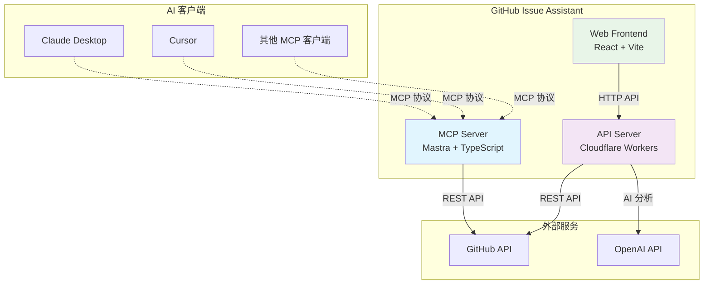

# GitHub Issue Assistant MCP

> 🤖 基于 Mastra + MCP 构建的智能 GitHub Issue 管理助手

## 📌 项目简介

**GitHub Issue Assistant MCP** 是一个基于 [Mastra](https://mastra.io) 与 [Model Context Protocol (MCP)](https://modelcontextprotocol.io) 构建的智能开发工具。它允许你在 AI 对话（Claude Desktop、Cursor 等）中通过自然语言创建、管理 GitHub Issue，并提供 AI 智能分析和自动分类功能。

### ✨ 核心特性

- 🎯 **自然语言交互** - 在 AI 对话中直接管理 GitHub Issue
- 🧠 **AI 智能分析** - 自动分析 Issue 优先级和推荐标签
- 🔧 **多接口支持** - MCP 协议 + REST API + GraphQL + Web UI
- 🏗️ **现代架构** - Monorepo + TypeScript + Cloudflare Workers
- 🚀 **快速部署** - 一键启动本地开发和云端部署

---

## 🏗️ 系统架构

### 整体架构图



### 技术栈组成

| 组件 | 技术栈 | 功能描述 |
|------|--------|----------|
| **MCP Server** | Mastra + TypeScript + MCP SDK | 处理 MCP 协议，提供 GitHub 工具集 |
| **API Server** | Cloudflare Workers + GraphQL Yoga | 云端 API 服务，支持 AI 分析 |
| **Web Frontend** | React 18 + Vite + TypeScript | Web 界面，双模式（聊天 + Agent） |
| **AI 集成** | OpenAI GPT + 自然语言处理 | 智能分析、优先级分配、标签推荐 |

### Monorepo 结构

```
github-issue-assistant/
├── apps/
│   ├── mcp/          # MCP Server (Mastra)
│   ├── api/          # API Server (Cloudflare Workers)  
│   └── web/          # Web Frontend (React)
├── packages/         # 共享包
└── docs/            # 项目文档
```

---

## 🔧 功能特性

### 🎯 核心功能

| 功能模块 | 描述 | 状态 |
|---------|------|------|
| **Issue 管理** | 创建、列出、添加标签 | ✅ 已完成 |
| **AI 智能分析** | 优先级分配、标签推荐、摘要生成 | ✅ 已完成 |
| **多接口支持** | MCP + REST API + GraphQL + Web UI | ✅ 已完成 |
| **自然语言处理** | 命令解释和执行 | ✅ 已完成 |

### 🛠️ 可用工具

| 工具名称 | 功能描述 | 输入参数 | 使用示例 |
|---------|---------|---------|----------|
| `github_list_issues` | 列出仓库 Issues | `owner`, `repo`, `state?` | "列出 microsoft/vscode 的 open Issues" |
| `github_create_issue` | 创建新 Issue | `owner`, `repo`, `title`, `body?` | "在我的项目创建一个关于性能优化的 Issue" |
| `github_add_labels` | 添加 Issue 标签 | `owner`, `repo`, `number`, `labels` | "给 #42 添加 bug 和 urgent 标签" |
| `github_triage` | AI 智能分析 | `title`, `body?` | "分析这个 bug report 的优先级" |
| `github_auto_triage_and_create` | 自动分析并创建 | `owner`, `repo`, `title`, `body?` | "智能创建并分类这个功能请求" |

### 🎨 界面预览

**Web UI 双模式：**
- **聊天模式** - 类 ChatGPT 界面，支持自然语言对话
- **Agent 模式** - 结构化表单，快速操作 GitHub Issue

---

## 🚀 快速开始

### 📋 环境要求

- Node.js 18+
- pnpm 8+
- GitHub Personal Access Token
- OpenAI API Key（可选，用于 AI 功能）

### ⚙️ 环境配置

1. **克隆项目**
```bash
git clone https://github.com/yourusername/github-issue-assistant.git
cd github-issue-assistant
```

2. **安装依赖**
```bash
pnpm install
```

3. **配置环境变量**
```bash
# apps/mcp/.env
GITHUB_TOKEN=github_pat_xxxxxxxxxx
OPENAI_API_KEY=sk-xxxxxxxxxx

# apps/api/.env
GITHUB_TOKEN=github_pat_xxxxxxxxxx
OPENAI_API_KEY=sk-xxxxxxxxxx
```

### 🏃‍♂️ 启动服务

```bash
# 启动 MCP Server
pnpm -F ./apps/mcp dev

# 启动 API Server (新终端)
pnpm -F ./apps/api dev

# 启动 Web Frontend (新终端)
pnpm -F ./apps/web dev
```

### 🔗 Claude Desktop 集成

在 Claude Desktop 配置文件中添加：

```json
{
  "mcpServers": {
    "github-issue-assistant": {
      "command": "pnpm",
      "args": ["-F", "./apps/mcp", "dev"],
      "cwd": "/path/to/github-issue-assistant"
    }
  }
}
```

重启 Claude Desktop 即可在对话中使用！

### 🧪 测试功能

```bash
# 测试工具列表
pnpm -F ./apps/mcp run tools

# 测试 AI 分析
pnpm -F ./apps/mcp run try:triage -- '{"title":"Bug in login", "body":"Users cannot login"}'

# 测试自动创建
pnpm -F ./apps/mcp run try:auto -- '{"owner":"myorg","repo":"myrepo","title":"Feature request"}'
```

---

## 🌐 API 接口

### REST API 端点

| 端点 | 方法 | 功能 | 请求示例 |
|------|------|------|----------|
| `/mcp/github_list_issues` | POST | 列出 Issues | `{"owner":"org","repo":"name"}` |
| `/mcp/github_create_issue` | POST | 创建 Issue | `{"owner":"org","repo":"name","title":"标题"}` |
| `/mcp/github_triage` | POST | AI 分析 | `{"title":"Bug report","body":"详细描述"}` |

### GraphQL 查询

```graphql
query {
  issues(owner: "microsoft", repo: "vscode", state: OPEN) {
    title
    body
    labels
    createdAt
  }
}
```

**完整 API 文档**: [查看详细接口文档](#-http-mcp-endpoints)

---

## 🛡️ 安全配置

### GitHub Token 权限

推荐使用细粒度 Personal Access Token，最小权限：
- ✅ **Issues**: Read and write
- ✅ **Metadata**: Read-only
- ❌ **Contents**: 不需要
- ❌ **Actions**: 不需要

### 环境变量安全

```bash
# .env 文件配置
GITHUB_TOKEN=github_pat_xxxxxxxxxx
OPENAI_API_KEY=sk-xxxxxxxxxx

# .gitignore 确保包含
.env
.env.local
*.env
```

### CORS 配置

API 服务器自动配置 CORS，支持跨域请求：

```javascript
{
  "Access-Control-Allow-Origin": "*",
  "Access-Control-Allow-Headers": "content-type,authorization",
  "Access-Control-Allow-Methods": "GET,POST,OPTIONS"
}
```

---

## 📈 项目路线图

### ✅ 已完成功能

- [x] MCP 服务器基础架构
- [x] GitHub API 集成（Issues 管理）
- [x] OpenAI 智能分析
- [x] Web UI 界面
- [x] REST API 支持
- [x] Claude Desktop 集成
- [x] 多环境部署支持

### 🚧 开发中功能

- [ ] Issue 评论管理
- [ ] Pull Request 支持  
- [ ] 批量操作功能
- [ ] 实时通知系统
- [ ] 高级搜索和过滤

### 🔮 计划中功能

- [ ] **多平台支持** - GitLab、Bitbucket 集成
- [ ] **工作流自动化** - GitHub Actions 触发
- [ ] **团队协作** - 多用户权限管理
- [ ] **数据分析** - Issue 趋势和报表
- [ ] **自定义模板** - Issue/PR 模板管理
- [ ] **Webhook 集成** - 实时事件处理

### 🎯 性能优化计划

- [ ] **缓存策略** - Redis 缓存 GitHub API 响应
- [ ] **批量处理** - 支持批量创建和更新
- [ ] **API 限流** - 智能的 Rate Limiting
- [ ] **离线支持** - PWA 离线功能

---

## 🛠️ 开发指南

### 🏗️ 本地开发

```bash
# 开发模式启动所有服务
pnpm dev

# 单独启动某个服务
pnpm -F ./apps/mcp dev    # MCP Server
pnpm -F ./apps/api dev    # API Server  
pnpm -F ./apps/web dev    # Web Frontend
```

### 🧪 测试

```bash
# 运行所有测试
pnpm test

# 运行特定模块测试
pnpm -F ./apps/mcp test
pnpm -F ./apps/api test
```

### 📦 构建部署

```bash
# 构建所有应用
pnpm build

# 部署到 Cloudflare
pnpm -F ./apps/api deploy
pnpm -F ./apps/web deploy
```

### 🔧 代码规范

```bash
# 代码格式化
pnpm format

# 类型检查
pnpm typecheck

# Lint 检查
pnpm lint
```

---

## 🤝 贡献指南

### 🐛 Bug 反馈

遇到问题？请 [提交 Issue](https://github.com/yourusername/github-issue-assistant/issues/new?template=bug_report.md)

### 💡 功能建议  

有好的想法？请 [提交功能请求](https://github.com/yourusername/github-issue-assistant/issues/new?template=feature_request.md)

### 🔧 代码贡献

1. Fork 项目
2. 创建功能分支 (`git checkout -b feature/amazing-feature`)
3. 提交更改 (`git commit -m 'Add amazing feature'`)
4. 推送分支 (`git push origin feature/amazing-feature`)
5. 创建 Pull Request

### 📝 文档改进

文档位于 `/docs` 目录，欢迎改进：
- API 文档
- 使用教程
- 架构说明
- 最佳实践

---

## 📄 许可证

本项目基于 MIT 许可证开源 - 查看 [LICENSE](LICENSE) 文件了解详情。

---

## 📊 项目统计


---

<details>
<summary>📋 详细的 HTTP API 文档</summary>

## 🌐 HTTP MCP Endpoints

除了标准的 MCP 协议支持，本项目还提供了 HTTP REST API 接口，方便 Web 前端和其他应用集成。

### 🔗 API Base URL

- **开发环境**: `http://localhost:8787` (使用 `wrangler dev`)
- **生产环境**: `https://mcp-api.tingzhuangzhou.workers.dev`

### 📡 可用端点

| 端点 | 方法 | 功能描述 | 请求体 |
|------|------|---------|--------|
| `/mcp/github_list_issues` | POST | 列出仓库 Issues | `{"owner": "org", "repo": "name", "state": "open"}` |
| `/mcp/github_create_issue` | POST | 创建新 Issue | `{"owner": "org", "repo": "name", "title": "标题", "body": "内容"}` |
| `/mcp/github_add_labels` | POST | 添加标签 | `{"owner": "org", "repo": "name", "number": 42, "labels": ["bug"]}` |
| `/mcp/github_triage` | POST | AI 智能分析 | `{"title": "Issue 标题", "body": "Issue 内容"}` |
| `/mcp/github_auto_triage_and_create` | POST | 自动分析并创建 | `{"owner": "org", "repo": "name", "title": "标题", "body": "内容"}` |

### 📝 示例调用

```bash
# 列出 GitHub Issues
curl -X POST "https://mcp-api.tingzhuangzhou.workers.dev/mcp/github_list_issues" \
  -H "Content-Type: application/json" \
  -d '{"owner": "microsoft", "repo": "vscode", "state": "open"}'

# AI 分析 Issue
curl -X POST "https://mcp-api.tingzhuangzhou.workers.dev/mcp/github_triage" \
  -H "Content-Type: application/json" \
  -d '{"title": "Memory leak in extension", "body": "Detailed description..."}'

# 自动分析并创建 Issue
curl -X POST "https://mcp-api.tingzhuangzhou.workers.dev/mcp/github_auto_triage_and_create" \
  -H "Content-Type: application/json" \
  -d '{"owner": "myorg", "repo": "myrepo", "title": "Bug report", "body": "Steps to reproduce..."}'
```

### 🔑 环境变量配置

为了使 HTTP MCP 端点正常工作，需要在 Cloudflare Workers 环境中配置以下变量：

| 变量名 | 必需 | 描述 | 示例值 |
|--------|------|------|--------|
| `GITHUB_TOKEN` | ✅ | GitHub Personal Access Token | `github_pat_xxxxxxxxxx` |
| `OPENAI_API_KEY` | ✅ | OpenAI API Key (用于 AI 分析) | `sk-xxxxxxxxxx` |
| `FRONTEND_ORIGIN` | ❌ | 前端域名 (CORS 配置) | `https://github-issue-assistant.pages.dev` |

#### 🛠️ 配置步骤

1. **本地开发**：在 `apps/api/.env` 文件中设置
   ```bash
   GITHUB_TOKEN=github_pat_xxxxxxxxxx
   OPENAI_API_KEY=sk-xxxxxxxxxx
   ```

2. **生产部署**：在 Cloudflare Workers 管理面板中设置环境变量
   - 进入 Worker 设置页面
   - 添加环境变量
   - 重新部署 Worker

### 🌍 CORS 支持

所有 HTTP MCP 端点都自动配置了 CORS，支持跨域请求：

```javascript
{
  "Access-Control-Allow-Origin": "*", // 或配置的 FRONTEND_ORIGIN
  "Access-Control-Allow-Headers": "content-type,authorization",
  "Access-Control-Allow-Methods": "GET,POST,OPTIONS"
}
```

### 📋 错误处理

API 返回标准的 JSON 错误格式：

```json
{
  "error": "GitHub 401: Bad credentials"
}
```

常见错误：
- `GITHUB_TOKEN missing` - 未配置 GitHub Token
- `OPENAI_API_KEY missing` - 未配置 OpenAI API Key
- `owner/repo required` - 缺少必需参数
- `GitHub 401: Bad credentials` - GitHub Token 无效或过期

### 🎯 前端集成

参考 `apps/web/src/api.ts` 中的实现：

```typescript
// 通用 MCP 调用函数
export async function mcp(path: string, payload: any) {
  const response = await fetch(`${API_BASE}${path}`, {
    method: "POST",
    headers: { "content-type": "application/json" },
    body: JSON.stringify(payload),
  });
  
  if (!response.ok) {
    const error = await response.json();
    throw new Error(error?.error || response.statusText);
  }
  
  return response.json();
}

// 具体的 GitHub 操作
export const githubAutoTriageAndCreate = (params) => 
  mcp("/mcp/github_auto_triage_and_create", params);
```

</details>
