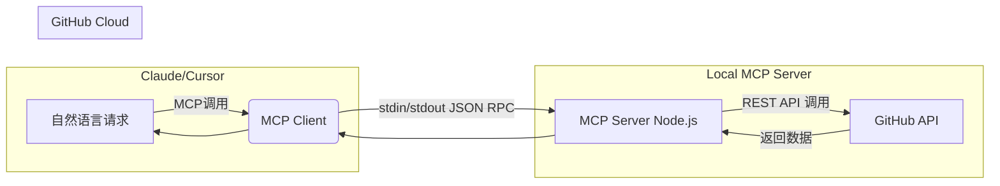

# GitHub Issue Assistant MCP

## 📌 项目简介

**GitHub Issue Assistant MCP** 是一个基于 [Model Context Protocol (MCP)](https://modelcontextprotocol.io) 的本地工具服务，允许你直接在 AI 对话中（如 Claude Desktop、Cursor 等支持 MCP 的客户端）使用自然语言创建、管理和查看 GitHub 仓库的 Issue。

本项目旨在演示如何利用 MCP 将日常研发工作流（如任务跟踪、Bug 报告、需求讨论）与 AI Agent 无缝结合，实现：

* **自然语言 → GitHub 操作** 的即时转化
* **安全受控** 的访问权限（基于细粒度 PAT）
* **可扩展** 的工具接口（支持增删改查等多类 Issue 操作）

---

## 🎯 项目意图

本项目是一次结合**云端 AI 开发助手**与**实际开发流程自动化**的实践，适用于：

* 在 AI 对话中快速生成标准化的 Issue 模板
* 自动分配标签和负责人
* 从对话上下文直接同步到 GitHub 仓库，减少上下文切换
* 在教学或作业中展示 MCP 的端到端集成能力

---

## 🏗 技术架构



**主要组件：**

1. **MCP Server (`server.mjs`)**

   * 使用 `@modelcontextprotocol/sdk` 构建
   * 提供 `create_issue`、`add_labels`、`list_issues` 等工具
2. **MCP Client**

   * Claude Desktop 或 Cursor
   * 通过本地配置文件将 MCP Server 接入 AI 对话环境
3. **GitHub REST API**

   * 使用细粒度 PAT（Personal Access Token）进行授权
   * 所需最小权限：`Issues: Read and write` + `Metadata: Read-only`

---

## 🔧 功能清单

| 功能             | 描述           | 输入参数                                        | 示例调用                                                   |
| -------------- | ------------ | ------------------------------------------- | ------------------------------------------------------ |
| `create_issue` | 创建新 Issue    | owner, repo, title, body, labels, assignees | “帮我在 `myorg/myrepo` 创建一个标题为‘前端 Bug’的 Issue 并打上 bug 标签” |
| `add_labels`   | 给 Issue 添加标签 | owner, repo, number, labels                 | “给 myrepo 的 #42 添加 `help wanted` 标签”                   |
| `list_issues`  | 列出仓库的 Issues | owner, repo, state(open/closed/all)         | “列出我在 myrepo 中所有 open 状态的 Issue”                       |

---

## ⚙️ 环境变量配置

```bash
# 必需
GITHUB_TOKEN=ghp_xxxxxxxx       # GitHub PAT
# 可选（减少每次输入 owner/repo）
GH_DEFAULT_OWNER=my-github-username
GH_DEFAULT_REPO=my-repo
```

> 建议使用 **细粒度 PAT** 并只勾选必要权限，避免暴露仓库或组织内的其他敏感数据。

---

## 🚀 快速启动

```bash
npm install
GITHUB_TOKEN=your_token_here node server.mjs
```

在 Claude Desktop / Cursor 中将该 MCP Server 添加到配置文件，重启客户端即可。

---

## 🛡️ 安全注意事项

* 不要在仓库提交 `.env` 文件或包含 Token 的代码
* 为不同用途的项目生成独立的 PAT
* 对组织仓库的访问需确认已获批准

---

## 🌟 亮点

* **易用性**：零侵入接入现有对话式 AI 工作流
* **安全性**：最小权限设计，支持细粒度访问控制
* **扩展性**：可轻松添加新功能，如评论、关闭 Issue，甚至跨平台协作工具集成
